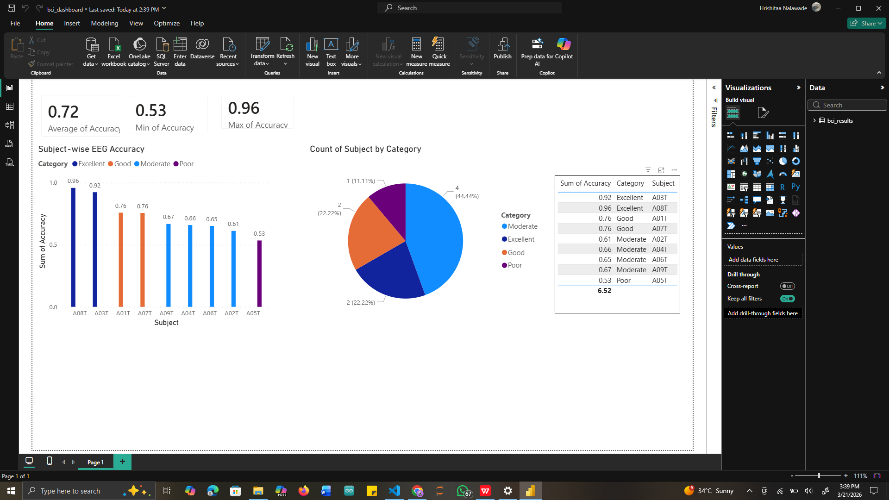

# Brain-Computer Interface (BCI) Motor Imagery Classification

This project implements a **Brain-Computer Interface (BCI) pipeline** that predicts imagined hand movements from EEG brain signals using machine learning.

The system processes EEG signals recorded during **motor imagery tasks** and classifies whether the subject imagined moving their **left hand or right hand**.

---

# Project Overview

Brain–Computer Interfaces allow computers to interpret brain activity and convert it into commands.

In this project, EEG signals are analyzed to detect **motor imagery**, where a subject imagines moving a body part without physically moving.

Example:

EEG Signal → Model → Predicted Movement  
EEG Data → Machine Learning Model → LEFT HAND

Applications include:

- Assistive technology for paralysis patients
- Prosthetic limb control
- Neurorehabilitation
- Human–computer interaction

---

# Dataset

This project uses the **BCI Competition IV Dataset 2a**, which contains EEG recordings from multiple subjects performing motor imagery tasks.

Each subject imagines one of four movements:

- Left Hand
- Right Hand
- Feet
- Tongue

This project focuses on **binary classification**:

Left Hand vs Right Hand

Dataset source:  
https://www.bbci.de/competition/iv/

---

# Pipeline Overview

The system follows a structured machine learning pipeline:
Raw EEG → Bandpass Filter → Event Extraction → Epoching → ML Pipeline → Accuracy

### ML Pipeline:

CSP → StandardScaler → SVM → Cross-validation

---

# Step-by-Step Method

## 1. EEG Data Loading

EEG recordings are loaded from `.gdf` files using the **MNE library**.

---

## 2. Signal Filtering

A **bandpass filter (8–30 Hz)** is applied to retain motor imagery-related frequencies (mu and beta rhythms).

---

## 3. Event Extraction

Event markers identify motor imagery tasks:

| Code | Meaning    |
| ---- | ---------- |
| 769  | Left Hand  |
| 770  | Right Hand |

Only these two classes are used.

---

## 4. Epoch Extraction

Continuous EEG signals are segmented into **epochs (1s–4s)** around each event.

Each epoch represents one trial.

---

## 5. Feature Extraction + Classification

Feature extraction and classification are combined using a **scikit-learn Pipeline**:

````python
Pipeline([
    ('csp', CSP(n_components=4)),
    ('scaler', StandardScaler()),
    ('svm', SVC(kernel='rbf'))
])


---

# Step-by-Step Method

## 1. EEG Data Loading

EEG recordings are loaded from `.gdf` files using the **MNE library**.

---

## 2. Signal Filtering

A **bandpass filter (8–30 Hz)** is applied to retain motor imagery-related frequencies (mu and beta rhythms).

---

## 3. Event Extraction

Event markers identify motor imagery tasks:

| Code | Meaning    |
| ---- | ---------- |
| 769  | Left Hand  |
| 770  | Right Hand |

Only these two classes are used.

---

## 4. Epoch Extraction

Continuous EEG signals are segmented into **epochs (1s–4s)** around each event.

Each epoch represents one trial.

---

## 5. Feature Extraction + Classification

Feature extraction and classification are combined using a **scikit-learn Pipeline**:

```python
Pipeline([
    ('csp', CSP(n_components=4)),
    ('scaler', StandardScaler()),
    ('svm', SVC(kernel='rbf'))
])
````

## 📊 Power BI Dashboard

This dashboard visualizes subject-wise EEG classification performance.

### Key Insights:
- Average Accuracy: **0.72**
- Maximum Accuracy: **0.96**
- Minimum Accuracy: **0.53**
- Performance categorized into: Excellent, Good, Moderate, Poor

<p align="center">
  
</p>

> Note: The Power BI (.pbix) file is not included due to size constraints.
